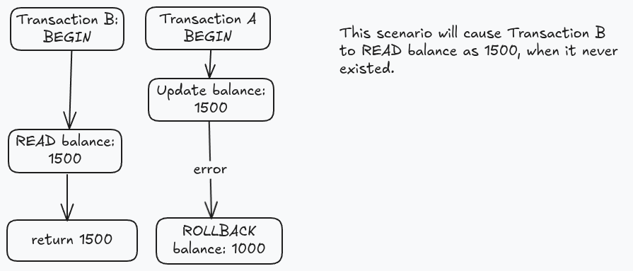
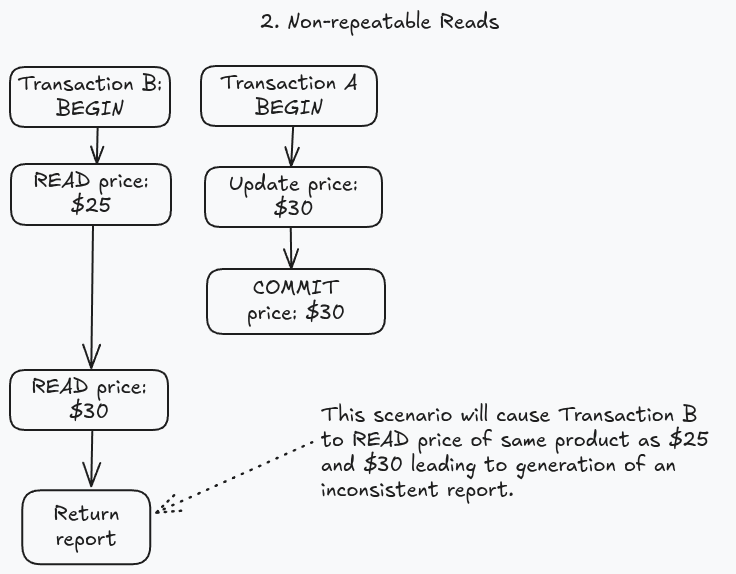
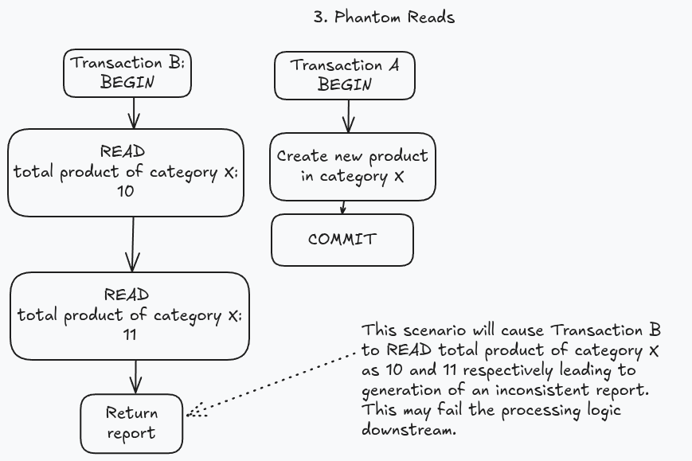
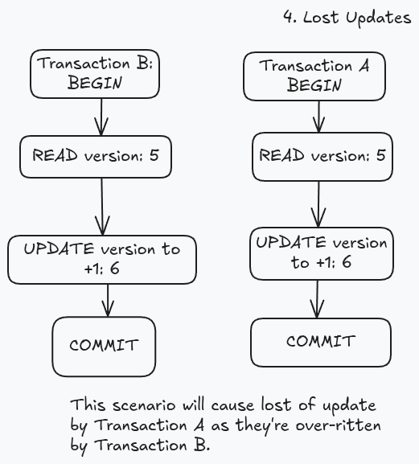

<b>ACID</b> properties (Atomicity, Consistency, Isolation, Durability) are fundamental concepts which guides database management systems through
already solved problems and tradeoff in choices.

But to understand these properties individually, we’ll first need to understand <b>Transaction</b>.

## Transaction
A transaction is a collection of SQL queries treated as one unit of work at application logic. 
**Example**: A money transfer between accounts would requires multiple operations (check balance, debit one account, credit another) 
that must all succeed or fail together to avoid spilling money.

Transaction's lifecycle usually involves keywords to begin (`BEGIN`), to save changes (`COMMIT`) and discard changes (`ROLLBACK`).
Each of these commands are implemented differently across different DBMS. 
For Example, `COMMIT` can save changes to disk directly, or gather multiple changes in memory before flushing them to disk together.
All such decision have their own tradeoff, the first option is lot slower than other but prevents any data loss. 
And both options are viable as you can use first option where each byte of data is of at-most importance like banking while you can use other options for log storage where each byte doesn't matter much.

Transactions are mostly associated with writes, but you can also have read-only transactions. 
For example, **Read-only** transactions are valuable for generating consistent reports by providing a time-based snapshot of data

System crashes during transactions require special handling. Databases must be able to recover and maintain consistency in such events. 
This can be handled by using data structure like **Write Ahead Log** (`WAL`) which appends every change happening to database
and it can be replayed to restore the database to its last state.

<blockquote>
💡Even single query is wrapped in transactions internally by database systems even when its not explicitly defined by users
</blockquote>

## Atomicity
Atomicity principle tells that every transaction should be treated as indivisible unit of work. 
Either all queries within it succeed or fail, no in-betweens. To handle this, the DB needs to handle scenarios like
- When any Query fails (due to constraints, syntax errors, etc.), the database must roll back all previous successful queries in that transaction
- If a database crashes mid-transaction before commit, all changes must be rolled back upon restart to maintain data integrity. 
  For Example, in a money transfer transaction losing atomicity could result in money disappearing when one account is debited but the other isn't credited
    
Different database systems implement atomicity differently. 
Some write changes to disk immediately (*optimistic* approach), while others keep changes in memory until commit.

## Isolation
Isolation addresses the question if a transaction should see changes made by other concurrent transactions.
For example, we’re reading a group of entries and another transaction changes an entry we’re reading. 
Here we’ve to make a decision whether we want to read this change or not. 
And due to this decision we can encounter few well-known side effects known as **read phenomena**.

**Read phenomena** are side effects (usually undesirable) that occurs when multiple transactions interact concurrently. 
And to prevent these phenomena, the principle of **Isolation** level is introduced.
Let’s discuss these major read phenomena along with the required Isolation level to prevent them below:
- **Dirty Reads**: When a transaction can Read uncommitted changes made by another concurrent transaction, those Read could be potentially Dirty. 
  Because the changes could've been rolled back or lost in case of some crash.
  
    This Phenomena can be prevented by Isolation level above **Read Committed**, which allows queries to only see changes which are committed by other transactions.
    
- **Non-Repeatable Reads**: When you read the same entry more than once in a transaction, and it yields different values each time. 
  For example, you read the value for one instruction and then collect sum for that column in another instruction. 
  Both times we're accessing the same value but if we've Non-Repeatable Reads it could end up with inconsistent data which wouldn't tally in our report.
  That is why its named *non-repeatable* as in you can't read repeated value in the same transaction.

  This can be prevented by using an Isolation level above **Repeatable Reads**,  which keeps a version of entries already accessed in a transaction to avoid any changes to it.
      
  This is the cost of using a higher isolation level to allow repeatable read at the expense of slowing the database who needs to maintain versions of each such transaction. 
  Due to this, it is advised to keep isolation level as per your workload requirement.
 
- **Phantom Reads**: Suppose you're performing a range query twice in a transaction, and an additional row appears in your second query.
  This could cause problems similar to Non-Repeatable Reads yet it can't be solved with Repeatable Reads Isolation level as the row we've to version isn't present yet (and hence named Phantom Read).

  Phantom Reads can be prevented by using Isolation Level above **Snapshot** which keep a version of the whole database at the start of transaction.
  This Isolation Level guarantees to solve all read phenomena (but is significantly costly)
  <blockquote>💡 Important: Implementation of Isolation levels can vary between different database systems.
  For example, in PostgreSQL Repeatable Read is implemented as Snapshot Isolation level, as it keep version of whole database and thus even prevents phantom reads unlike standard Repeatable Read discussed above.
  </blockquote>

- **Lost Updates** - Suppose you’ve made some changes in a transaction but those changes are overwritten by another concurrent transaction while the first transaction is still underway.
  As such, when you go to read this value within same transaction you’ll get a different value and as such the original written value is lost (earning the name *lost update*).
   
  Lost Updates can be prevented by **Snapshot** isolation level. In some database system, it could be prevented using **Repeatable Read** along with some locking mechanism. 

---

TLDR; different *Isolation levels* are used to provide guarantees against read phenomenas as mention in table below

| *Isolation Level* | *Dirty Reads* | *Non-repeatable Reads* | *Phantom Reads* | *Lost Updates* |
| --- | --- | --- | --- | --- |
| *Read Uncommitted* | *Possible* | *Possible* | *Possible* | *Possible* |
| *Read Committed* | *Prevented* | *Possible* | *Possible* | *Possible* |
| *Repeatable Read* | *Prevented* | *Prevented* | *Possible** | *Prevented*** |
| *Snapshot* | *Prevented* | *Prevented* | *Prevented* | *Prevented* |
| *Serializable* | *Prevented* | *Prevented* | *Prevented* | *Prevented* |

Each DBMS implements Isolation Levels differently. But these can be categorized into mainly two approaches:
1. **Pessimistic** approaches which primarily uses locks to isolate the data. These locks can be on row, table upto page level. 
2. **Optimistic** approaches keeps track of transactions and fail once which overstep other's isolation level. 
   The downside being now the user have to retry their request however it comes at a significantly reduced overhead of lock management.  

Choosing the right isolation level involves *trade-offs* between consistency and performance and thus depends on your workload.

## Consistency
Consistency plays an important role in development of different database platforms like SQL, NoSQL, Graph, etc. 
But when defining Consistency, it actually comes in two forms
1. **Data Consistency** ensures consistent data w.r.t to the defined data model like referential integrity or counts.
   Orphaned references should be cleaned up by either database or application to avoid inconsistent data.
2. **Read Consistency** ensures consistent data across different instances of database servers. 
   It ensures that a transaction sees the most recent committed changes immediately. 
   This challenge is introduced due to **Replication**, specifically when data written to primary isn't yet synced to replicas.
   To optimize for performance, we usually trade off this criteria, such as in case **Eventual consistency** where the application is allowed temporarily to show stale data before eventually becoming consistent.
   **Synchronous replication** offers stronger consistency but is a lot slower compared to asynchronous approaches which boils it down to trade off.
    

## Durability
**Durability** ensures changes from a committed transaction are permanently stored on non-volatile storage (e.g., SSD, HDD)
— even if the system losses power loss or crashes.

Database Systems play around a lot with this concept to optimize their performance since writing to disk is slower in magnitude compared to writing to memory.
Some Databases write to memory first and then flush the changes to disk in bulk which is a compromise with durability since all the data case of power loss is lost from memory.
To avoid such cases, a seperate data structure is maintained which stores the changes to table on disk in delta.
The data structure can be replayed before restarting a database to restore it to the original state and as such avoid any data loss. 
The only reason its possible is due small size of delta being written to disk.
<blockquote>
When you save data to disk, OS may lie about it being persisted because it caches the writes first before flushing to disk for better performance.
So Databases instead use the fsync command to force immediate disk writes, ensuring durability but at a performance cost.
</blockquote>

Some Databases like Redis even offer configurable durability — from strong (immediate writes) to eventual (delayed persistence) — letting users choose between speed and safety.

---
At the end of day, if a transaction is reported as committed, the data **must** be recoverable after a crash — or the system breaks the durability promise.
For mission-critical systems, strong durability is non-negotiable; for less critical data, eventual durability may be acceptable. 
All of this boils down to trade off between different metrics and its upto the developer to decide which is most important for their workload.